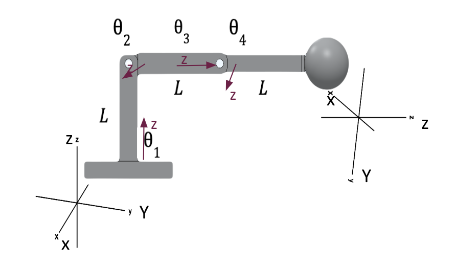

# Extended Vision Arm

This is the final analytical project for the course Foundations of Robotics (EE238a). 

 
Abstract—The purpose of this paper is to show the detailed analysis of a vision extending robotic arm in an RRPR configuration. The Forward Kinematics, Inverse Kinematics, Velocity Kinematics, Statics, and Dynamics are all derived through a combination of hand calculations and programmable algorithms created in MATLAB. All but the Dynamics formulations were successfully derived and example values are illustrated for numerical results.

  
 
Fig. 1. Home configuration of the Extended Vision Arm. 
